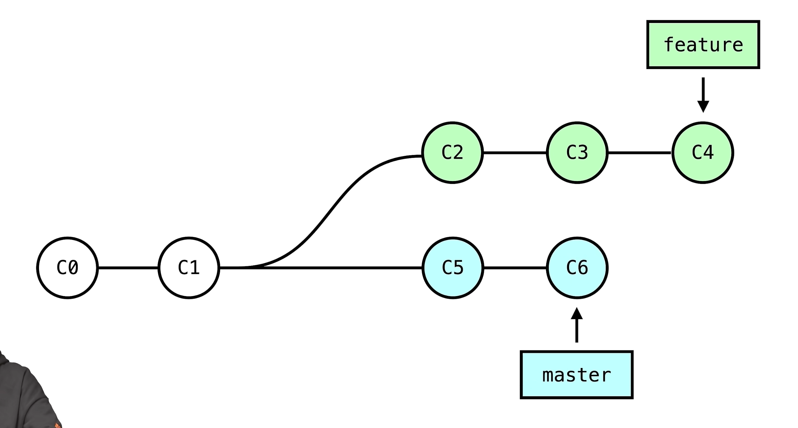

## git rebase

- `git merge master` vs `git rebase master`

## Bonus

### Search

- `s` or `/`: focus on search bar
- [search syntax](https://docs.github.com/en/search-github/github-code-search/understanding-github-code-search-syntax)
  - Search by repository name, description, or contents of the README file
    - qualifer: in:name, in:description, in:topics, etc
- [Understanding GitHub Code Search syntax](https://docs.github.com/en/search-github/getting-started-with-searching-on-github/understanding-the-search-syntax)
  - Query for values greater or less than another value
  - Query for values between a range

### Project Browsing

- `t`: go to file, search by filename under current repository
- `l`: jump to line
- copy permanant address for this line of code with this branch
- `b`: code/blame switch
- `.`: open current branch in `gitub.dev`
- `K`: open the command panel
- [Keyboard Shortcuts](https://docs.github.com/en/get-started/accessibility/keyboard-shortcuts)

### avoid using git stash

The problem of using stash:

- A lot of time, when you checkout to a branch, you did not rememeber if this branch has a stashed code.
- stashed code can be applied to any brach, which makes this very dangerous, when you stash pop to a wrong branch, and conflict happened.

The correct way:

- use git commit instead
- use `git reset HEAD~1` when you switch back end continue work on your branch.
